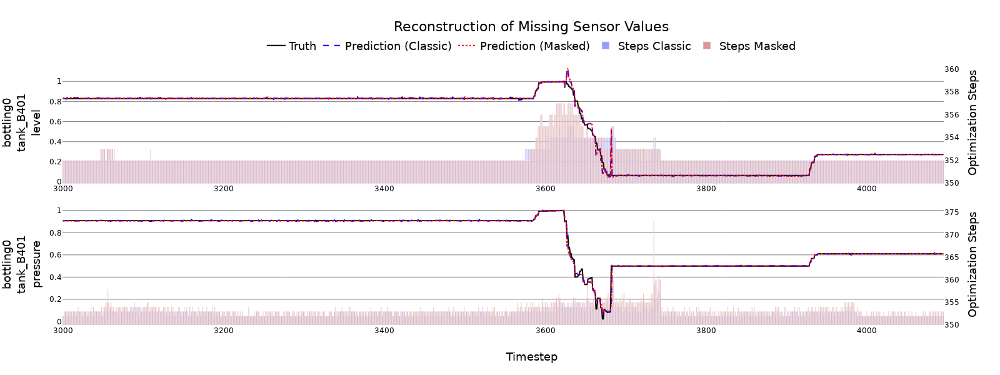

# Creating Virtual Sensors Using Neural Networks

## Paper
> **Title:** `Creating Virtual Sensors Using Neural Networks`  
> **Authors:** `Björn Ludwig`, `Jonas Ehrhardt`, `Oliver Niggemann`  
> **Conference:** [30th IEEE International Conference on Emerging Technologies and Factory Automation](https://etfa2025.ieee-ies.org/index.html)  
> **Track:** [Track 10 - Artificial Intelligence for Cyber Physical Systems in Automation](https://etfa2025.ieee-ies.org/technical_tracks/track10/index.html)  

## Environment Variables

To run this project, you will need to add the following environment variables to your .env file

name: sensor-reconstruction
channels:
  - pytorch
  - nvidia
  - conda-forge
  - defaults
dependencies:
  - python=3.10
  - pytorch=2.1.0
  - torchvision
  - torchaudio
  - pytorch-cuda=11.8  # Adjust depending on your CUDA version
  - numpy
  - pandas
  - matplotlib
  - scikit-learn
  - tqdm
  - tensorboard
  - joblib
  - pip
  - pip:
      - protobuf  # Ensure compatibility with TensorBoard

## Acknowledgements

For the paper we used the following two benchmarks:

 - [Hamburg AI Benchmark for Cyber-Physical Systems (HAI-CPS)](https://github.com/j-ehrhardt/hai-cps-benchmark)
 - [FaultsOf4-TankBatchProcess](https://github.com/thomasbierweiler/FaultsOf4-TankBatchProcess)

## Usage/Examples

Run the file main.py from command line, passing it the experiment folder "experiment1_ds6", to do the training (example using DS6 of HAI-CPS).
- python3 main.py --experiment_folder data/experiment1_ds1
- python3 main.py --experiment_folder data/experiment1_ds1_masked

Run the file main_opt.py to do the optimization run (example using DS6 of HAI-CPS).
- python3 main_opt.py --experiment_folder data/experiment_ds1
- python3 main_opt.py --experiment_folder data/experiment_ds1_masked

## Results
### Training process:
For model training, we exclusively used the data that represent the normal operating mode, consistent with the standard procedure in classical anomaly detection tasks. A MinMaxScaler was applied to normalize all sensor readings in the range of [0,1], ensuring comparability between the different systems and datasets. For evaluation using the AI Benchmark for Diagnosis, Reconfiguration, and Planning we trained 37 distinct models, employing two-fold cross-validation and two fixed random seeds. For the 4-Tank benchmark, three different models were trained using the same number of folds and random seeds. We trained for 2000 epochs for the cluster-based models and 3000 epochs for the full model in order to account for the model size. 

The results of the training are displayed in Table below in the two columns classic MSE Loss Test and masked MSE Loss Test, representing the mean squared error for the test dataset for a classic or masked training process. For the masked training approach, we trained the model for 250 epochs on clean data, before setting up to 5, but maximum 20\% of sensors in the dataset, as missing, by masking them as -1. In the test dataset we did not mask sensors, to make it comparable to the classic training process.

Table: Classic vs. Masked MSE Loss Test

| Data  | Cluster | #Sens. | Classic MSE Loss Test      | Masked MSE Loss Test      |
|-------|:-------:|-------:|---------------------------:|--------------------------:|
| DS1   | Full    |     13 | 1.42e-4 ± 1.94e-11         | 2.99e-4 ± 1.30e-9         |
| DS2   | 1       |      6 | 8.60e-3 ± 9.82e-5          | 3.51e-2 ± 2.97e-5         |
| DS2   | 2       |      6 | 6.99e-3 ± 9.74e-5          | 9.18e-2 ± 4.17e-5         |
| DS2   | 3       |      7 | 6.27e-2 ± 1.74e-6          | 6.82e-2 ± 2.71e-3         |
| DS2   | Full    |     19 | 1.68e-4 ± 2.04e-10         | 6.68e-4 ± 2.04e-9         |
| DS3   | Full    |     10 | 1.98e-5 ± 2.27e-11         | 9.30e-4 ± 5.61e-7         |
| DS4   | Full    |     10 | 1.73e-5 ± 1.98e-10         | 1.97e-4 ± 6.34e-10        |
| DS5   | 1       |     14 | 7.99e-5 ± 4.34e-9          | 3.21e-4 ± 2.63e-8         |
| DS5   | 2       |      9 | 1.16e-4 ± 7.09e-11         | 3.01e-4 ± 1.96e-9         |
| DS5   | Full    |     23 | 4.13e-5 ± 6.18e-11         | 2.65e-4 ± 4.90e-8         |
| DS6   | 1       |     16 | 1.97e-5 ± 2.63e-12         | 6.26e-5 ± 5.21e-12        |
| DS6   | 2       |      6 | 5.71e-3 ± 6.50e-5          | 6.24e-2 ± 7.50e-3         |
| DS6   | 3       |      7 | 6.15e-2 ± 3.16e-7          | 4.45e-2 ± 7.48e-4         |
| DS6   | 4       |      4 | 1.61e-2 ± 4.79e-4          | 1.06e-1 ± 1.82e-3         |
| DS6   | 5       |      6 | 1.13e-2 ± 2.21e-4          | 3.63e-2 ± 4.44e-4         |
| DS6   | Full    |     39 | 4.14e-5 ± 1.57e-12         | 8.59e-5 ± 4.26e-11        |
| DS7   | 1       |      6 | 8.44e-3 ± 1.42e-4          | 9.77e-3 ± 1.05e-4         |
| DS7   | 2       |      6 | 7.17e-3 ± 1.03e-4          | 7.80e-3 ± 9.50e-5         |
| DS7   | 3       |      8 | 1.76e-2 ± 6.12e-4          | 5.75e-4 ± 1.86e-8         |
| DS7   | Full    |     20 | 2.35e-5 ± 3.89e-11         | 1.08e-4 ± 8.14e-10        |
| DS8   | 1       |      9 | 1.59e-4 ± 2.45e-9          | 7.48e-2 ± 2.14e-3         |
| DS8   | 2       |      6 | 6.34e-3 ± 8.02e-5          | 1.14e-1 ± 7.26e-4         |
| DS8   | 3       |      6 | 7.98e-3 ± 1.27e-4          | 5.83e-2 ± 9.48e-5         |
| DS8   | 4       |     12 | 7.16e-4 ± 1.21e-9          | 9.60e-4 ± 2.18e-8         |
| DS8   | Full    |     33 | 4.48e-5 ± 5.76e-12         | 1.04e-4 ± 3.86e-10        |
| DS9   | 1       |      6 | 1.06e-2 ± 1.85e-4          | 9.93e-2 ± 2.39e-3         |
| DS9   | 2       |      6 | 8.29e-3 ± 1.37e-4          | 6.62e-2 ± 4.62e-3         |
| DS9   | 3       |      6 | 5.06e-3 ± 5.08e-5          | 4.93e-2 ± 2.78e-3         |
| DS9   | 4       |     11 | 2.73e-4 ± 9.61e-11         | 5.57e-4 ± 2.38e-10        |
| DS9   | Full    |     29 | 5.27e-5 ± 5.45e-11         | 1.04e-4 ± 2.37e-10        |
| DS10  | 1       |      6 | 5.22e-3 ± 5.44e-5          | 9.51e-2 ± 7.23e-3         |
| DS10  | 2       |      9 | 1.27e-4 ± 5.52e-10         | 4.99e-2 ± 1.72e-4         |
| DS10  | 3       |      6 | 5.53e-3 ± 6.10e-5          | 8.36e-2 ± 1.00e-2         |
| DS10  | 4       |     11 | 1.23e-3 ± 8.73e-9          | 1.67e-3 ± 7.39e-8         |
| DS10  | 5       |      9 | 1.46e-4 ± 2.09e-9          | 7.35e-2 ± 2.15e-3         |
| DS10  | 6       |     14 | 6.64e-4 ± 5.49e-9          | 1.57e-3 ± 1.92e-7         |
| DS10  | Full    |     55 | 9.37e-5 ± 1.92e-11         | 1.40e-4 ± 8.86e-11        |
| SMA   | 1       |      3 | 2.10e-4 ± 1.17e-8          | 4.47e-1 ± 4.29e-2         |
| SMA   | 2       |     26 | 7.91e-5 ± 2.71e-10         | 3.53e-4 ± 2.84e-9         |
| SMA   | Full    |     29 | 1.24e-4 ± 2.04e-11         | 2.28e-4 ± 2.35e-11        |

### Sensor reconstruction
The reconstruction was tested for every combination of model and sensor. Each of these runs utilized the complete test datasets. For each optimization, a maximum of 5000 steps was performed, with early stopping applied if an improvement of at least 1\% relative to the mean MSE of the first 100 steps was not achieved within 250 steps, resulting in a minimum of 350 steps.  
Example results of reconstruction for the level and the pressure of tank B401 of component bottling0 of DS6 of the [Hamburg AI Benchmark for Cyber-Physical Systems (HAI-CPS)](https://github.com/j-ehrhardt/hai-cps-benchmark) benchmark using the trained (classic / masked) LSTM autoencoder of the complete dataset (full).

## License

[MIT](https://choosealicense.com/licenses/mit/)

